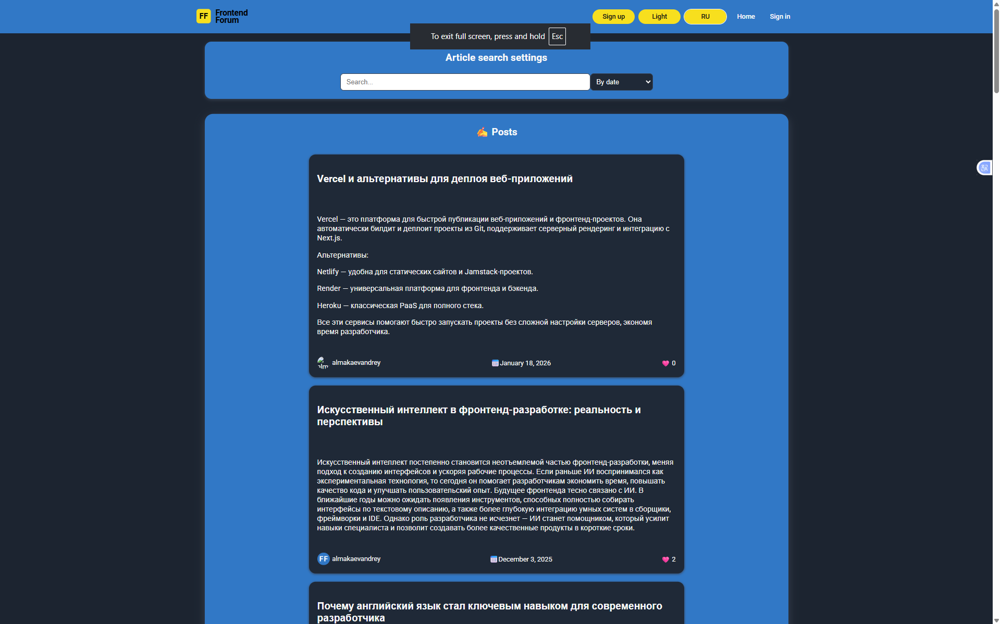
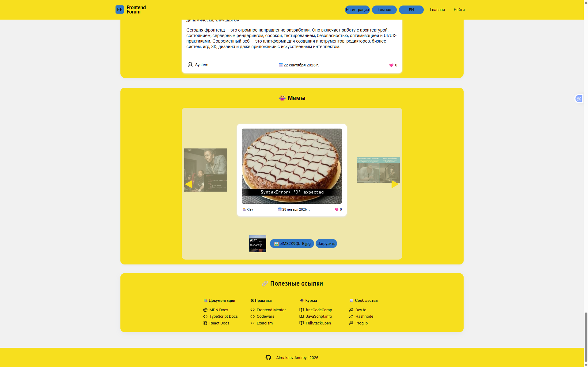

<h1 align="center">🔥 Production ready fullstack forum platform built with scalable architecture and real-world engineering practices.</h1>

<p align="center"> 
 
 
 
 
 
 
 
</p>

<p align="center">
  
</p>

---

# 🎯 О проекте

**Frontend Forum** это production fullstack приложение IT-форума, где пользователи создают посты, делятся мемами, обсуждают темы и взаимодействуют через лайки и комментарии.

Проект разработан с нуля, включая:

- собственную сборку на Webpack
- архитектуру Feature-Sliced Design
- полностью типизированный backend на TypeScript
- загрузку медиа через Cloudinary
- тестирование и CI-подход

 <p>Это не учебный CRUD, а приложение, построенное с использованием реальных production-паттернов.</p>

---

# 🌍 Live Demo
| Сервис | Ссылка |
|--------|--------|
| **Frontend (Vercel)** | [Open App](https://frontend-forum-three.vercel.app/) |
| **Backend API (Render)** | [API Base URL](https://frontend-forum.onrender.com) |

---

# 🧱 Архитектура (FSD)

Примеры:

- entities — Post, User, Meme
- features — auth, likes, comments
- widgets — PostList, MemeSlider
- shared — ui, api, lib

Такой подход обеспечивает масштабируемость и поддержку проекта.

---

# 🚀 Функциональность

## 🧑‍💻 Пользователь
- регистрация / вход / выход
- JWT через cookieы
- роли: **admin**, **user**, **guest**  
- защищённые маршруты  
- сохранение сессии  

## 📝 Посты & Комментарии
- создание / редактирование / удаление  
- лайки  
- комментарии  
- пагинация  
- сортировка и фильтры  
- lazy loading
- memes

## 🖼 Мемы 
- загрузка изображений
- лайки
- отображение в слайдере

## ✍️ Rich Text Editor
- редактор на Quill
- форматирование текста
- безопасный рендер через DOMPurify (XSS protection)

## 🎨 Интерфейс
- dark/light темы  
- Styled Components ThemeProvider  
- i18n (RU / EN)  
- toast-уведомления  
- страницы ошибок (404 / 403 / 500)

## 🔐 Безопасность
- хэширование паролей (bcrypt)
- JWT авторизация
- Role-based access control (RBAC)
- CORS конфигурация
- XSS защита (DOMPurify)
- серверная валидация (Zod)

## 🧪 Тестирование
- Unit и integration тесты
- Jest + React Testing Library
- моки API
- проверка loading / error / success состояний
- Husky hooks с прогоном тестов перед push

## ⚙️ Dev-функции
- Husky pre-push hooks  
- Webpack: decomposition, optimization  
- строгие линтеры (ESLint + Prettier)  
- проверки перед пушем  

---

# 🧩 Tech Stack

## 🎨 Frontend
| Технология |
|-----------|
| **React 19** |
| **TypeScript** |
| **Webpack (custom)** |
| **Redux Toolkit + RTK Query** |
| **Styled Components** |
| **React Hook Form + Zod** |
| **i18n (react-i18next)** | 
| **Quill Editor** | 
| **Jest + RTL** |

## 🛠 Backend
| Технология |
|-----------|
| **Node.js + Express** | 
| **TypeScript** | 
| **MongoDB + Mongoose** | 
| **JWT + Cookies** | 
| **Session Storage** | 
| **Role middleware** | 

---

# 🖼 Пример интерфейса

| Dark Theme | Light Theme |
|-----------|-------------|
| ||

  

---

# 🔧 Установка и запуск

```bash
# Клонирование репозитория
git clone https://github.com/username/frontend-forum.git

# Переход в каталог
cd frontend-forum

# Установка зависимостей
npm install

# Запуск в dev-режиме
npm run dev

# Production-сборка
npm run build
